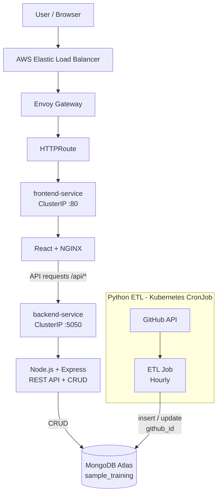

# Sistem Mimarisi

## 1. Genel Bakış

Bu proje; React + NGINX frontend, Node.js/Express backend, Python ETL ve MongoDB Atlas veri katmanından oluşan konteynırize bir uygulamadır.

Ana deployment ortamı **AWS EKS**'tir. Frontend ve backend Kubernetes `Deployment` kaynakları olarak, ETL ise saatlik `CronJob` olarak çalıştırılmaktadır.

AWS ortamında dış HTTP erişimi Envoy Gateway ve HTTPRoute üzerinden sağlanmakta, Envoy Gateway'in `LoadBalancer` Service'i AWS Elastic Load Balancer tarafından dışarıya açılmaktadır.

Python ETL, GitHub API üzerinden repository bilgilerini almakta ve `github_id` alanı üzerinden MongoDB'deki `github_repositories` collection'ında insert/update işlemi gerçekleştirmektedir.

CI/CD GitHub Actions üzerinden çalışır. `main` branch'ine yapılan başarılı push sonrasında GitHub OIDC ile AWS IAM Role alınır, image'lar Amazon ECR'a gönderilir ve AWS EKS'e deploy edilir.

Yerel Docker Desktop Kubernetes ortamı ise geliştirme ve doğrulama amacıyla korunmuştur.

---

## 2. Genel Mimari



---

## 3. Bileşenler

### 3.1 Frontend

Frontend React ile geliştirilmiş ve production container içerisinde NGINX tarafından sunulmaktadır.

Görevleri:

* Kullanıcı arayüzünü sunmak
* Record oluşturma ve güncelleme işlemlerini başlatmak
* Backend API'lerine HTTP istekleri göndermek

Frontend Kubernetes üzerinde:

```text
frontend Deployment
        ↓
frontend-service
        ↓
React + NGINX
```

şeklinde çalışmaktadır.

`frontend-service` `ClusterIP` tipindedir; dış erişim doğrudan Pod'a değil Gateway üzerinden sağlanmaktadır.

Frontend Deployment'ında `/` endpoint'i üzerinden liveness ve readiness probe'ları tanımlanmıştır. Ayrıca, CPU ve memory resource requests/limits tanımlanmıştır. Kaynak ihtiyaçları ve kullanım sınırları Kubernetes tarafından yönetilmektedir.

---

### 3.2 Backend

Backend Node.js ve Express kullanmaktadır.

Başlıca görevleri:

* REST API sağlamak
* Record CRUD işlemlerini gerçekleştirmek
* Input ve ObjectId validation yapmak
* MongoDB ile iletişim kurmak
* Healthcheck endpoint'i sağlamak

Backend Kubernetes üzerinde:

```text
backend Deployment
        ↓
backend-service
        ↓
Node.js / Express
```

şeklinde çalışmaktadır.

`backend-service` `ClusterIP` tipindedir ve doğrudan internete açılmamıştır.

Backend Deployment'ında `/healthcheck/` endpoint'i üzerinden liveness ve readiness probe'ları tanımlanmıştır. CPU ve memory resource requests/limits uygulanmıştır. Tek node'lu EKS ortamında kontrollü rolling update için `maxSurge: 0` ve `maxUnavailable: 1` kullanılmıştır.

---

### 3.3 MongoDB

Normal uygulama deployment'ında kalıcı veri katmanı olarak **MongoDB Atlas** kullanılmaktadır.

Database:

```text
sample_training
```

Başlıca collection'lar:

```text
records
github_repositories
```

Backend `records` collection'ı üzerinden uygulama kayıtlarını yönetmektedir.

Python ETL ise `github_repositories` collection'ını kullanmaktadır.

MongoDB bağlantı bilgileri source code içerisinde hardcode edilmemiş ve environment variable / Kubernetes Secret üzerinden sağlanmıştır.

---

### 3.4 Python ETL

Python ETL, GitHub API'den repository bilgilerini alarak MongoDB'ye aktarmaktadır.

Akış:

```text
Kubernetes CronJob
        ↓
Python ETL
        ↓
GitHub API
        ↓
Repository data
        ↓
MongoDB Atlas
```

ETL schedule:

```text
0 * * * *
```

CronJob `Europe/Istanbul` timezone'u kullanarak saatlik çalışmaktadır.

Duplicate kayıtları önlemek için GitHub repository ID'si olan `github_id` benzersiz kayıt anahtarı olarak kullanılmaktadır.

Aynı repository tekrar işlendiğinde `upsert=True` ile mevcut document güncellenmektedir.

ETL CronJob'unda CPU ve memory resource requests/limits tanımlanmıştır. CronJob one-shot Job'lar oluşturduğu için liveness/readiness probe kullanılmamaktadır.

---

## 4. Web İstek Akışı

AWS EKS üzerindeki normal kullanıcı trafiği:

```text
Browser
   ↓
AWS Elastic Load Balancer
   ↓
Envoy Gateway
   ↓
HTTPRoute
   ↓
frontend-service
   ↓
React / NGINX
   ↓
/api/*
   ↓
backend-service
   ↓
Node.js / Express
   ↓
MongoDB Atlas
```

Frontend container içerisindeki NGINX, `/api/` ile başlayan istekleri Kubernetes içerisindeki:

```text
backend-service:5050
```

adresine yönlendirmektedir.

Bu yapı sayesinde backend Service doğrudan internetten erişilebilir durumda değildir.

---

## 5. ETL Veri Akışı

ETL veri akışı web request akışından bağımsızdır:

```text
Kubernetes CronJob
        ↓
Python ETL
        ↓
GitHub API
        ↓
Repository JSON
        ↓
MongoDB Atlas
        ↓
github_repositories
```

Repository'nin GitHub ID'si:

```text
github_id = 1361100555
```

alanında tutulmaktadır.

Aynı repository tekrar işlendiğinde yeni bir document oluşturulmaz; mevcut document güncellenir.

---

## 6. Kubernetes Kaynakları

AWS EKS ortamında kullanılan temel kaynaklar:

| Kaynak              | Görev                                                     |
| ------------------- | --------------------------------------------------------- |
| Namespace           | Uygulama kaynaklarını izole etmek                         |
| Backend Deployment  | Node.js/Express backend çalıştırmak                       |
| Backend Service     | Backend'e cluster içi erişim sağlamak                     |
| Frontend Deployment | React/NGINX frontend çalıştırmak                          |
| Frontend Service    | Frontend'e cluster içi erişim sağlamak                    |
| ETL CronJob         | Saatlik Python ETL çalıştırmak                            |
| Secret              | Credential ve bağlantı bilgilerini workload'lara aktarmak |
| GatewayClass        | Envoy Gateway controller'ını kullanmak                    |
| Gateway             | Dış HTTP erişim noktası sağlamak                          |
| HTTPRoute           | HTTP trafiğini Service'lere yönlendirmek                  |

Frontend ve backend stateless `Deployment` olarak çalıştırılmaktadır.

ETL periyodik bir workload olduğu için `CronJob` olarak yapılandırılmıştır.

MongoDB normal deployment'ta Kubernetes workload'u olarak çalıştırılmamaktadır; MongoDB Atlas kullanılmaktadır.

Frontend ve backend Deployment'larında liveness/readiness probe'ları tanımlanmıştır. Backend `/healthcheck/`, frontend `/` endpoint'i üzerinden kontrol edilmektedir. Backend, frontend ve ETL workload'larında CPU ve memory resource requests/limits bulunmaktadır.

Backend Deployment'ı tek node'lu EKS ortamına uygun olarak `maxSurge: 0` ve `maxUnavailable: 1` ile kontrollü rolling update kullanmaktadır.

---

## 7. Ağ ve Erişim Modeli

Frontend ve backend Service'leri `ClusterIP` tipindedir.

```text
Internet
   ↓
AWS Load Balancer
   ↓
Envoy Gateway
   ↓
HTTPRoute
   ├── /      → frontend-service
   └── /api/* → backend-service
```

Bu yapı sayesinde:

- Backend doğrudan internete açılmaz.
- Frontend Service NodePort olarak expose edilmez.
- Her servis için ayrı bir cloud Load Balancer oluşturulmaz.
- Dış trafik merkezi olarak Envoy Gateway üzerinden yönetilir.

MongoDB Atlas ise cluster dışındaki managed database olarak kullanılır.

---

## 8. Konfigürasyon ve Secret Yönetimi

Hassas bilgiler source code veya Docker image içerisinde tutulmamaktadır.

Temel yaklaşım:

```text
GitHub Actions Secrets / .env
            ↓
      Kubernetes Secret
            ↓
    Application Containers
```

Başlıca secret değerleri:

```text
ATLAS_URI
GITHUB_TOKEN
MONGODB_URI
```

Local Kubernetes deployment'ında `setup-k8s.ps1` `.env` değerlerinden Secret kaynaklarını oluşturur.

AWS EKS deployment'ında GitHub Actions Secrets kullanılarak Kubernetes Secret kaynakları güncellenir.

Gerçek credential, token veya private key repository içerisinde tutulmamaktadır.

---

## 9. Container Güvenliği

Frontend, backend ve ETL container'ları root kullanıcıyla çalıştırılmamaktadır.

Kullanıcılar:

```text
Backend  → node / UID 1000
Frontend → nginx / UID 101
ETL      → appuser / UID 10001
```

Kubernetes workload'larında ayrıca:

```yaml
runAsNonRoot: true

allowPrivilegeEscalation: false

capabilities:
  drop:
    - ALL
```

ayarları kullanılmaktadır.

Bu kontroller container privilege seviyesini azaltmak ve privilege escalation riskini sınırlandırmak amacıyla uygulanmıştır.

---

## 10. Healthcheck ve Operasyonel Doğrulama

Backend healthcheck endpoint'i:

```text
GET /healthcheck/
```

şeklindedir.

Backend Deployment'ında bu endpoint hem liveness hem de readiness probe olarak kullanılmaktadır. Frontend Deployment'ında ise `/` endpoint'i liveness ve readiness probe olarak kullanılmaktadır.

Bu probe'lar uygulama process'lerinin HTTP üzerinden erişilebilir ve trafik almaya hazır olup olmadığını kontrol etmektedir. Backend healthcheck MongoDB dependency'sini doğrudan doğrulamaz.

CI/CD deployment sonrasında:

```text
Kubernetes rollout
       ↓
Backend healthcheck
       ↓
Frontend HTTP check
```

adımları ile deployment doğrulanmaktadır.

Ayrıca ETL CronJob ve Job geçmişi Kubernetes üzerinden kontrol edilmektedir.

Backend, frontend ve ETL workload'larında CPU ve memory resource requests/limits tanımlıdır. Backend Deployment'ı tek node'lu EKS ortamında kontrollü rolling update kullanmaktadır.

---

## 11. CI/CD Mimarisi

CI/CD GitHub Actions üzerinde çalışmaktadır.

Pull Request veya push sırasında önce validation aşaması çalışır:

```text
Git Push / Pull Request
          ↓
GitHub Actions
          ↓
Frontend build
          ↓
Backend validation
          ↓
Python validation
          ↓
Docker image build validation
```

`main` branch'ine başarılı push sonrasında gerçek cloud deployment gerçekleştirilir:

```text
main push
   ↓
CI validation
   ↓
GitHub OIDC
   ↓
AWS IAM Role
   ↓
Amazon ECR
   ↓
AWS EKS
   ↓
Kubernetes rollout
   ↓
Gateway / HTTPRoute
   ↓
Backend healthcheck
   ↓
Frontend HTTP check
```

Deployment job'ı:

- GitHub OIDC ile AWS IAM Role'u assume eder.
- Frontend, backend ve ETL image'larını build eder.
- Image'ları Git commit SHA ile tag'ler.
- Image'ları Amazon ECR'a push eder.
- EKS kubeconfig'i oluşturur.
- Kubernetes Secret kaynaklarını günceller.
- EKS manifestlerini uygular.
- Gateway ve HTTPRoute kaynaklarını uygular.
- Rollout ve dış erişim kontrollerini gerçekleştirir.

CI validation başarısız olursa deployment job'ı çalıştırılmaz.

---

## 12. AWS EKS ve Amazon ECR

Ana Kubernetes ortamı:

```text
Cluster:
devops-case-eks

Region:
eu-central-1

Managed Node Group:
devops-workers

Node Type:
t3.small
```

EKS için cloud-specific manifestler:

```text
k8s/eks/
```

altında bulunmaktadır.

Amazon ECR üzerinde üç ayrı image repository kullanılmaktadır:

```text
devops-case-backend
devops-case-frontend
devops-case-etl
```

Image'lar Git commit SHA ile tag'lenmektedir.

Örnek:

```text
devops-case-etl:<commit-sha>
```

Bu yapı deployed image ile source commit arasında doğrudan ilişki kurulmasını sağlar.

---

## 13. GitHub OIDC ve AWS Authentication

GitHub Actions AWS erişiminde uzun ömürlü AWS access key kullanılmamaktadır.

Authentication akışı:

```text
GitHub Actions
      ↓
GitHub OIDC token
      ↓
GitHubActions-EKS-Deploy IAM Role
      ↓
Temporary AWS credentials
      ↓
Amazon ECR + AWS EKS
```

IAM Role'un OIDC trust policy'si ilgili GitHub repository ve `main` branch'i ile sınırlandırılmıştır.

EKS tarafında ayrıca EKS Access Entry ve namespace-scoped Kubernetes RBAC kullanılmaktadır.

---

## 14. Kubernetes RBAC

GitHub Actions IAM Role'u EKS Access Entry aracılığıyla:

```text
github-actions-deploy
```

Kubernetes grubuna bağlanmıştır.

Bu grup için:

```text
devops-case
```

namespace'i ile sınırlı `Role` ve `RoleBinding` tanımlanmıştır.

GitHub Actions'a `cluster-admin` yetkisi verilmemiştir.

RBAC manifesti:

```text
k8s/eks/cd-rbac.yaml
```

---

## 15. Veri Kalıcılığı ve Backup

MongoDB, uygulamanın kalıcı veri katmanıdır ve MongoDB Atlas üzerinde tutulmaktadır.

Backup:

```text
MongoDB Atlas
      ↓
mongodump
      ↓
backups/sample-training-backup/
```

Restore:

```text
Backup files
      ↓
mongorestore
      ↓
MongoDB Atlas
      ↓
Database / UI verification
```

Backup ve restore süreci gerçek veri üzerinde uçtan uca test edilmiştir.

Detaylı yöntem, komutlar, retention, RPO/RTO ve production sınırlamaları:

```text
docs/backup-restore.md
```

---

## 16. Yerel Kubernetes Ortamı

AWS EKS ana deployment ortamıdır.

Docker Desktop Kubernetes ise local geliştirme ve doğrulama amacıyla korunmuştur.

Local kaynaklar:

```text
k8s/
```

Local Kubernetes kurulumu:

```powershell
.\setup-k8s.ps1
```

Bu yapı cloud deployment'ın alternatifi değil, geliştirme ve doğrulama ortamıdır.

---

## 17. Sistem Özeti

Sistem sorumlulukları:

```text
Frontend
    → User interface

Backend
    → REST API + CRUD + validation

MongoDB Atlas
    → Persistent data layer

Python ETL
    → GitHub API → MongoDB

Kubernetes
    → Workload orchestration

Envoy Gateway
    → HTTP routing

AWS Load Balancer
    → External access

Amazon ECR
    → Container image registry

GitHub Actions
    → CI/CD automation

GitHub OIDC + AWS IAM
    → Cloud authentication
```

Bu ayrıştırma sayesinde frontend, backend ve ETL bağımsız container image'ları ve Kubernetes workload'ları olarak yönetilebilmekte; CI/CD üzerinden source commit ile ilişkilendirilmiş image'lar AWS EKS'e otomatik olarak deploy edilebilmektedir.
