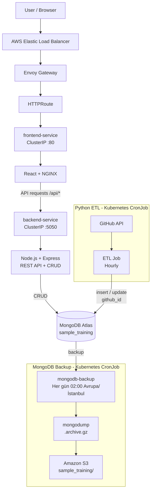

# Sistem Mimarisi

## 1. Genel Bakış

Bu proje; React + NGINX frontend, Node.js/Express backend, Python ETL ve MongoDB Atlas veri katmanından oluşan konteynırize bir uygulamadır.

Ana deployment ortamı **AWS EKS**'tir. Frontend ve backend Kubernetes `Deployment` kaynakları olarak, ETL ise saatlik `CronJob` olarak çalıştırılmaktadır.

AWS ortamında dış HTTP erişimi Envoy Gateway ve HTTPRoute üzerinden sağlanmakta, Envoy Gateway'in `LoadBalancer` Service'i AWS Elastic Load Balancer tarafından dışarıya açılmaktadır.

CI/CD GitHub Actions üzerinden çalışmakta; başarılı `main` branch deployment'larında production deployment öncesinde **controlled production approval** uygulanmaktadır. Yetkili reviewer onayının ardından GitHub OIDC ile AWS IAM Role alınarak image'lar Amazon ECR'a gönderilmekte ve AWS EKS'ye deploy edilmektedir.

Yerel Docker Desktop Kubernetes ortamı geliştirme ve doğrulama amacıyla korunmuştur.

MongoDB Atlas verileri ayrıca günlük bir Kubernetes CronJob ile `mongodump` kullanılarak Amazon S3'e yedeklenmektedir.

---

## 2. Genel Mimari



---

## 3. Bileşenler

### 3.1 Frontend

Frontend React ile geliştirilmiş ve production container içerisinde NGINX tarafından sunulmaktadır.

Görevleri:

- Kullanıcı arayüzünü sunmak
- Record oluşturma ve güncelleme işlemlerini başlatmak
- Backend API'lerine HTTP istekleri göndermek

Frontend Kubernetes üzerinde:

```text
frontend Deployment
        ↓
frontend-service
        ↓
React + NGINX
```

şeklinde çalışmaktadır.

`frontend-service` `ClusterIP` tipindedir ve dış erişim Gateway üzerinden sağlanmaktadır.

Frontend Deployment'ında `/` endpoint'i üzerinden liveness ve readiness probe'ları tanımlanmıştır. CPU ve memory resource requests/limits uygulanmıştır.

**---**

**### 3.2 Backend**

Backend Node.js ve Express kullanmaktadır.

Başlıca görevleri:

- REST API sağlamak
- Record CRUD işlemlerini gerçekleştirmek
- Input ve ObjectId validation yapmak
- MongoDB ile iletişim kurmak
- Healthcheck endpoint'i sağlamak

Backend Kubernetes üzerinde:

```text
backend Deployment
        ↓
backend-service
        ↓
Node.js / Express
```

şeklinde çalışmaktadır.

`backend-service` `ClusterIP` tipindedir ve doğrudan internete açılmamıştır.

Backend Deployment'ında liveness ve readiness probe'ları `/api/healthcheck/` endpoint'i üzerinden tanımlanmıştır. CPU ve memory resource requests/limits uygulanmıştır.

---

### 3.3 MongoDB

Normal uygulama deployment'ında kalıcı veri katmanı olarak **MongoDB Atlas** kullanılmaktadır.

Database:

```text
sample_training
```

Başlıca collection'lar:

```text
records

github_repositories
```

Backend `records` collection'ı üzerinden uygulama kayıtlarını yönetmektedir.

Python ETL ise `github_repositories` collection'ını kullanmaktadır.

MongoDB bağlantı bilgileri source code içerisinde hardcode edilmemiş ve environment variable / Kubernetes Secret üzerinden sağlanmıştır.

---

### 3.4 Python ETL

Python ETL, GitHub API'den repository bilgilerini alarak MongoDB'ye aktarmaktadır.

Akış:

```text
Kubernetes CronJob
        ↓
Python ETL
        ↓
GitHub API
        ↓
Repository data
        ↓
MongoDB Atlas
```

ETL schedule:

```text
0 * * * *
```

CronJob `Avrupa/İstanbul` timezone'u kullanarak saatlik çalışmaktadır.

Duplicate kayıtları önlemek için GitHub repository ID'si olan `github_id` benzersiz kayıt anahtarı olarak kullanılmaktadır.

Aynı repository tekrar işlendiğinde `upsert=True` ile mevcut document güncellenmektedir.

ETL CronJob'unda CPU ve memory resource requests/limits tanımlanmıştır. CronJob one-shot Job'lar oluşturduğu için liveness/readiness probe kullanılmamaktadır.

---

## 4. Ağ ve Web İstek Akışı

AWS EKS üzerindeki normal kullanıcı trafiği:

```text
Browser
   ↓
AWS Elastic Load Balancer
   ↓
Envoy Gateway
   ↓
HTTPRoute
   ↓
frontend-service
   ↓
React / NGINX
   ↓
/api/*
   ↓
backend-service
   ↓
Node.js / Express
   ↓
MongoDB Atlas
```

Frontend container içerisindeki NGINX, `/api/` ile başlayan istekleri Kubernetes içerisindeki:

```text
backend-service:5050
```

adresine yönlendirmektedir.

EKS ortamında dış `/api` trafiği ise Envoy Gateway ve HTTPRoute üzerinden backend Service'e yönlendirilir.

Frontend ve backend Service'leri `ClusterIP` tipindedir.

Bu yapı sayesinde:

- Backend doğrudan internete açılmaz.
- Frontend Service NodePort olarak expose edilmez.
- Her servis için ayrı bir cloud Load Balancer oluşturulmaz.
- Dış trafik merkezi olarak Envoy Gateway üzerinden yönetilir.

MongoDB Atlas ise cluster dışındaki managed database olarak kullanılır.

---

## 5. ETL Veri Akışı

ETL veri akışı web request akışından bağımsızdır:

```text
Kubernetes CronJob
        ↓
Python ETL
        ↓
GitHub API
        ↓
Repository JSON
        ↓
MongoDB Atlas
        ↓
github_repositories
```

Repository'nin GitHub ID'si:

```text
github_id = 1361100555
```

alanında tutulmaktadır.

Aynı repository tekrar işlendiğinde yeni bir document oluşturulmaz; mevcut document güncellenir.

---

## 6. Kubernetes Kaynakları

AWS EKS ortamında kullanılan temel kaynaklar:

| Kaynak                 | Görev                                                     |
| ---------------------- | --------------------------------------------------------- |
| Namespace              | Uygulama kaynaklarını izole etmek                         |
| Backend Deployment     | Node.js/Express backend çalıştırmak                       |
| Backend Service        | Backend'e cluster içi erişim sağlamak                     |
| Frontend Deployment    | React/NGINX frontend çalıştırmak                          |
| Frontend Service       | Frontend'e cluster içi erişim sağlamak                    |
| ETL CronJob            | Saatlik Python ETL çalıştırmak                            |
| MongoDB Backup CronJob | MongoDB verisini günlük olarak S3'e yedeklemek            |
| Backup ServiceAccount  | Backup workload'unun AWS/S3 erişimini sağlamak            |
| Secret                 | Credential ve bağlantı bilgilerini workload'lara aktarmak |
| Gateway                | Dış HTTP erişim noktası sağlamak                          |
| HTTPRoute              | HTTP trafiğini Service'lere yönlendirmek                  |

Frontend ve backend stateless `Deployment` olarak çalıştırılmaktadır.

ETL periyodik bir workload olduğu için `CronJob` olarak yapılandırılmıştır.

MongoDB normal deployment'ta Kubernetes workload'u olarak çalıştırılmamaktadır; MongoDB Atlas kullanılmaktadır.

Frontend ve backend Deployment'larında liveness/readiness probe'ları tanımlanmıştır. Backend `/api/healthcheck/`, frontend `/` endpoint'i üzerinden kontrol edilmektedir. Backend, frontend ve ETL workload'larında CPU ve memory resource requests/limits bulunmaktadır.

Backend Deployment'ı `maxSurge: 1` ve `maxUnavailable: 0` ile kontrollü `RollingUpdate` stratejisi kullanmaktadır. Yeni Pod readiness probe ile hazır olduktan sonra eski Pod sonlandırılmakta ve geçiş `v1 → v1 + v2 → v2` şeklinde gerçekleşmektedir.

AWS EKS uygulama kaynakları Kustomize ile yönetilmektedir:

```text
k8s/eks/              → ortak base
        ↓
overlays/dev/
overlays/test/
overlays/prod/
        ↓
Environment-specific configuration
```

---

## 7. Konfigürasyon ve Secret Yönetimi

Hassas bilgiler source code veya Docker image içerisinde tutulmamaktadır.

Temel yaklaşım:

```text
GitHub Actions Secrets / .env
            ↓
      Kubernetes Secret
            ↓
    Application Containers
```

Başlıca secret değerleri:

```text
ATLAS_URI
GITHUB_TOKEN
MONGODB_URI
```

Local Kubernetes deployment'ında `setup-k8s.ps1` `.env` değerlerinden Secret kaynaklarını oluşturur.

AWS EKS deployment'ında GitHub Actions Secrets kullanılarak Kubernetes Secret kaynakları güncellenir.

`MONGODB_URI` backup CronJob tarafından da Kubernetes Secret üzerinden alınmaktadır; MongoDB bağlantı bilgileri manifest içerisinde açık olarak tutulmamaktadır.

Gerçek credential, token veya private key repository içerisinde tutulmamaktadır.

---

## 8. Container Güvenliği

Frontend, backend ve ETL container'ları root kullanıcıyla çalıştırılmamaktadır.

Kullanıcılar:

```text
Backend  → node / UID 1000
Frontend → nginx / UID 101
ETL      → appuser / UID 10001
```

Kubernetes workload'larında ayrıca:

```yaml
runAsNonRoot: true

allowPrivilegeEscalation: false

capabilities:
  drop:
    - ALL
```

ayarları kullanılmaktadır.

Bu kontroller container privilege seviyesini azaltmak ve privilege escalation riskini sınırlandırmak amacıyla uygulanmıştır.

---

## 9. Healthcheck ve Operasyonel Doğrulama

Backend healthcheck endpoint'i:

```text
GET /healthcheck/
```

şeklindedir.

Backend Deployment'ında bu endpoint hem liveness hem de readiness probe olarak kullanılmaktadır. Frontend Deployment'ında ise `/` endpoint'i liveness ve readiness probe olarak kullanılmaktadır.

EKS ortamında backend healthcheck endpoint'i Envoy Gateway üzerinden `/api/healthcheck` adresine yönlendirilir.

Bu probe'lar uygulama process'lerinin HTTP üzerinden erişilebilir ve trafik almaya hazır olup olmadığını kontrol etmektedir. Backend healthcheck MongoDB dependency'sini doğrudan doğrulamaz.

CI/CD deployment sonrasında:

```text
Kubernetes rollout
       ↓
Backend healthcheck
       ↓
Frontend HTTP check
```

adımları ile deployment doğrulanmaktadır.

Ayrıca ETL CronJob ve Job geçmişi Kubernetes üzerinden kontrol edilmektedir.

---

## 10. CI/CD Mimarisi

CI/CD GitHub Actions üzerinde çalışmaktadır.

Pull Request veya push sırasında önce validation aşaması çalışır:

```text
Git Push / Pull Request
          ↓
GitHub Actions
          ↓
Frontend build
          ↓
Backend validation
          ↓
Python validation
          ↓
Docker image build validation
          ↓
Trivy security scan
```

`main` branch'ine başarılı push sonrasında gerçek cloud deployment gerçekleştirilir. Production deployment, GitHub Actions `production` Environment'ında tanımlı **controlled production approval** mekanizması nedeniyle yetkili reviewer onayı olmadan EKS'ye uygulanmaz.

Deployment akışı:

```text
main push
   ↓
CI validation
   ↓
Production approval
   ↓
GitHub OIDC
   ↓
AWS IAM Role
   ↓
Docker image build
   ↓
Amazon ECR push
   ↓
Kustomize prod overlay validation
   ↓
Kustomize deployment → AWS EKS
   ↓
Kubernetes rollout
   ↓
Gateway / HTTPRoute validation
   ↓
Backend healthcheck
   ↓
Frontend HTTP check
```

Deployment job'ı:

- GitHub Actions `production` Environment'ı üzerinden yetkili reviewer onayını bekler.
- Onay sonrasında GitHub OIDC ile AWS IAM Role'u assume eder.
- Frontend, backend ve ETL image'larını build eder.
- Image'ları Git commit SHA ile tag'ler.
- Image'ları Amazon ECR'a push eder.
- EKS kubeconfig'i oluşturur.
- Kubernetes Secret kaynaklarını günceller.
- Production Kustomize overlay'ini (`k8s/overlays/prod/`) server-side dry-run ile doğrular.
- Production overlay'ini EKS'ye uygular.
- Deployment image'larını commit SHA ile günceller.
- Rollout ve dış erişim kontrollerini gerçekleştirir.
- Gateway ve HTTPRoute kaynaklarını uygular.

Yetkili reviewer onayı alınmadığı sürece production deployment adımları çalıştırılmaz.

CI validation başarısız olursa deployment job'ı çalıştırılmaz.

CI aşamasında Trivy tarafından gerçekleştirilen container security scan sonuçları GitHub Actions log'larında raporlanmaktadır. Mevcut case yapılandırmasında `exit-code: 0` kullanıldığından vulnerability bulguları raporlanır ancak deployment otomatik olarak engellenmez.

---

## 11. AWS EKS ve Amazon ECR

Ana Kubernetes ortamı:

```text
Cluster:
devops-case-eks

Region:
eu-central-1

Managed Node Group:
devops-workers

Node Type:
t3.small
```

AWS production deployment `k8s/overlays/prod/` üzerinden gerçekleştirilmektedir.

Amazon ECR üzerinde üç ayrı image repository kullanılmaktadır:

```text
devops-case-backend
devops-case-frontend
devops-case-etl
```

Image'lar Git commit SHA ile tag'lenmektedir.

Örnek:

```text
devops-case-etl:<commit-sha>
```

Bu yapı deployed image ile source commit arasında doğrudan ilişki kurulmasını sağlar.

---

## 12. GitHub OIDC ve AWS Authentication

GitHub Actions AWS erişiminde uzun ömürlü AWS access key kullanılmamaktadır.

Authentication akışı:

```text
GitHub Actions
      ↓
GitHub OIDC token
      ↓
GitHubActions-EKS-Deploy IAM Role
      ↓
Temporary AWS credentials
      ↓
Amazon ECR + AWS EKS
```

IAM Role'un OIDC trust policy'si ilgili GitHub repository'nin `production` Environment'ı ile sınırlandırılmıştır. Production Environment yalnızca `main` branch'inden gelen deployment'ları kabul edecek şekilde yapılandırılmıştır.

Production deployment'ın EKS'ye uygulanmasından önce GitHub Actions `production` Environment'ı üzerinden yetkili reviewer onayı gerekmektedir.

EKS tarafında ayrıca EKS Access Entry ve namespace-scoped Kubernetes RBAC kullanılmaktadır.

---

**## 13. Kubernetes RBAC**

GitHub Actions IAM Role'u EKS Access Entry aracılığıyla:

```text
github-actions-deploy
```

Kubernetes grubuna bağlanmıştır.

Bu grup için:

```text
devops-case
```

namespace'i ile sınırlı `Role` ve `RoleBinding` tanımlanmıştır.

GitHub Actions'a `cluster-admin` yetkisi verilmemiştir.

RBAC manifesti:

```text
k8s/eks/cd-rbac.yaml
```

---

## 14. Veri Kalıcılığı ve Backup

MongoDB, uygulamanın kalıcı veri katmanıdır ve MongoDB Atlas üzerinde tutulmaktadır.

### 14.1 Otomatik Backup

Production ortamında MongoDB backup işlemi AWS EKS üzerinde çalışan `mongodb-backup` Kubernetes CronJob ile günlük olarak otomatikleştirilmiştir.

Backup akışı:

```text
MongoDB Atlas
      ↓
EKS CronJob
mongodb-backup
      ↓
mongodump
      ↓
.archive.gz
      ↓
Amazon S3
sample_training/
```

CronJob schedule:

```text
0 2 * * *
```

Timezone:

```text
Avrupa/İstanbul
```

Backup dosyaları UTC timestamp içeren ayrı birer arşiv dosyaları olarak oluşturulmaktadır.

Örnek:

```text
sample_training_20260912T230006Z.archive.gz
```

Buradaki `Z`, dosya adındaki timestamp'in UTC olduğunu belirtmektedir.

Backup workload'u ayrı bir ServiceAccount kullanmaktadır:

```text
s3-backup
```

MongoDB bağlantı bilgisi Kubernetes Secret üzerinden alınmaktadır. Backup container'ları root olmayan kullanıcılarla çalıştırılmakta ve `allowPrivilegeEscalation: false` ile `capabilities.drop: ALL` gibi container security ayarları uygulanmaktadır.

Backup arşivi oluşturulduktan sonra dosyanın boş olmadığı `test -s` ile kontrol edilmektedir. S3 upload işleminin ardından `aws s3api head-object` ile object'ın S3 üzerinde başarıyla oluşturulduğu doğrulanmaktadır.

Backup'lar Amazon S3 üzerinde cluster dışında saklanmaktadır:

```text
s3://devops-case-baykar-backups-203309795174/sample_training/
```

S3 erişimi backup workload'u için ayrı IAM yetkileri ile sınırlandırılmıştır. Backup policy yalnızca gerekli S3 bucket ve `sample_training/` prefix'i üzerindeki işlemlere izin vermektedir.

Kubernetes CronJob geçmişinde başarılı ve başarısız Job'lar için sınırlı history tutulmaktadır. Bu ayar S3 object retention policy'sinden bağımsızdır.

Bu case kapsamında S3 üzerinde otomatik Lifecycle tabanlı object retention/silme politikası uygulanmamıştır.

### 14.2 Manuel Local Backup ve Restore

Otomatik production backup mekanizmasına ek olarak backup ve restore akışı manuel olarak local ortamda da test edilebilmektedir.

Repository içerisinde bu amaçla kullanılan script:

```powershell
.\scripts\backup-restore.ps1 -Action Backup
```

Backup dosyaları local test sürecinde:

```text
backups/sample-training-backup/
```

altında oluşturulabilmektedir.

Restore işlemi:

```text
Backup files
      ↓
mongorestore
      ↓
MongoDB Atlas
      ↓
Database / UI verification
```

Script üzerinden restore:

```powershell
.\scripts\backup-restore.ps1 -Action Restore
```

Mevcut verinin silinerek restore edilmesi:

```powershell
.\scripts\backup-restore.ps1 -Action Restore -DropExisting
```

Backup ve restore süreci gerçek veri üzerinde uçtan uca test edilmiştir. Test sırasında kayıt oluşturulmuş, backup alınmış, veri silinmiş, silinen verinin UI ve database üzerinden kaybolduğu doğrulanmış ve ardından `mongorestore` ile veri geri yüklenmiştir.

Restore sonrasında database ve uygulama UI üzerinden verinin tekrar erişilebilir olduğu doğrulanmıştır.

Test sırasında `mongorestore` komutunun yaklaşık 1.3 saniyelik bir çalışma süresi ölçülmüştür. Bu değer tam bir production RTO ölçümü değildir; yalnızca restore komutunun gözlemlenen çalışma süresidir.

Backup yöntemi, restore adımları, doğrulama sonuçları, RPO/RTO değerlendirmesi ve mevcut production sınırlamaları:

```text
docs/backup-restore.md
```

içerisinde detaylandırılmıştır.

---

## 15. Yerel Kubernetes Ortamı

AWS EKS ana deployment ortamıdır.

Docker Desktop Kubernetes ise local geliştirme ve doğrulama amacıyla korunmuştur.

Local kaynaklar:

```text
k8s/
```

Local Kubernetes kurulumu:

```powershell
.\setup-k8s.ps1
```

Bu yapı cloud deployment'ın alternatifi değil, geliştirme ve doğrulama ortamıdır.

---

## 16. Sistem Özeti

Sistem sorumlulukları:

```text
Frontend
    → User interface

Backend
    → REST API + CRUD + validation

MongoDB Atlas
    → Persistent data layer

Python ETL
    → GitHub API → MongoDB

Kubernetes
    → Workload orchestration

Envoy Gateway
    → HTTP routing

AWS Load Balancer
    → External access

Amazon ECR
    → Container image registry

Amazon S3
    → Off-cluster MongoDB backup storage

Kubernetes Backup CronJob
    → Scheduled MongoDB backup

GitHub Actions
    → CI/CD automation

Trivy
    → Container image / dependency / secret scanning

GitHub OIDC + AWS IAM
    → CI/CD cloud authentication
```

Bu ayrıştırma sayesinde frontend, backend ve ETL bağımsız container image'ları ve Kubernetes workload'ları olarak yönetilebilmekte; CI/CD üzerinden source commit ile ilişkilendirilmiş image'lar **controlled production approval sonrasında** AWS EKS'ye deploy edilebilmekte ve MongoDB verileri günlük olarak cluster dışındaki Amazon S3 storage'a yedeklenebilmektedir.
