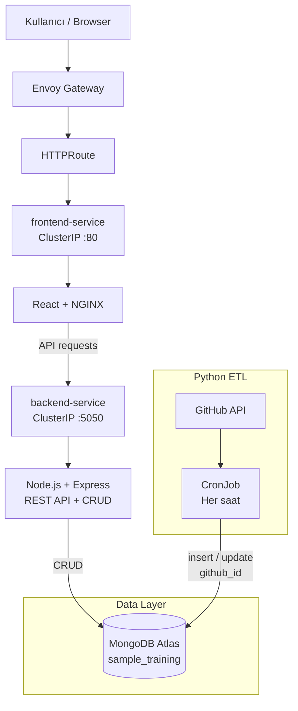

# Sistem Mimarisi

## 1. Genel Bakış

Bu proje, React tabanlı frontend, Node.js/Express backend, Python tabanlı ETL ve MongoDB veri katmanından oluşan konteynırize edilmiş bir MERN uygulamasıdır.

Uygulama Docker image'ları ile paketlenmekte ve Kubernetes üzerinde ayrı workload'lar olarak çalıştırılmaktadır. Dış erişim Kubernetes üzerindeki Envoy Gateway ve HTTPRoute üzerinden sağlanmaktadır.

Python ETL, GitHub API üzerinden repository bilgilerini saatlik olarak almakta ve MongoDB'ye `github_id` alanı üzerinden yeni kayıt veya güncelleme işlemi gerçekleştirmektedir.

CI/CD sürecinde GitHub Actions kullanılarak uygulama build ve validation işlemlerinden geçirilmekte, başarılı CI sonrasında geçici bir Kind Kubernetes cluster'ında deployment ve healthcheck doğrulamaları gerçekleştirilmektedir.

---

## 2. Mimari Diyagram



---

## 3. Bileşenler

### 3.1 Frontend

Frontend React ile geliştirilmiştir ve production container içerisinde NGINX tarafından sunulmaktadır.

Frontend'in görevi:

- Kullanıcı arayüzünü sunmak
- Record oluşturma ve güncelleme işlemlerini başlatmak
- Backend API'lerine HTTP istekleri göndermek
- `/api` path'i üzerinden backend'e erişmek

Frontend Kubernetes üzerinde `frontend` Deployment ve `frontend-service` Service olarak çalışmaktadır.

Service tipi `ClusterIP`'dir. Dış erişim doğrudan frontend Pod'una değil, Envoy Gateway ve HTTPRoute üzerinden Service'e yönlendirilir.

---

### 3.2 Backend

Backend Node.js ve Express kullanmaktadır.

Başlıca görevleri:

- REST API sağlamak
- Record CRUD işlemlerini gerçekleştirmek
- Gelen verileri doğrulamak
- MongoDB ile iletişim kurmak
- Healthcheck endpoint'i sağlamak

Backend Kubernetes üzerinde `backend` Deployment ve `backend-service` Service olarak çalışmaktadır.

Backend Service tipi `ClusterIP`'dir ve frontend tarafından Kubernetes iç ağından erişilmektedir.

---

### 3.3 MongoDB

Uygulamanın kalıcı verileri MongoDB Atlas üzerinde tutulmaktadır.

Kullanılan database:

```text
sample_training
```

Başlıca collection'lar:

```text
records
github_repositories
```

Backend `records` collection'ı üzerinden uygulama kayıtlarını yönetmektedir.

Python ETL ise `github_repositories` collection'ını kullanmaktadır.

MongoDB bağlantı bilgileri source code içerisinde sabitlenmemiştir ve environment variable / Kubernetes Secret üzerinden sağlanmaktadır.

---

### 3.4 Python ETL

Python ETL, GitHub API'den repository bilgilerini almakta ve MongoDB'ye aktarmaktadır.

Akış:

```text
GitHub API
    ↓
Python ETL
    ↓
MongoDB
```

ETL Kubernetes üzerinde CronJob olarak çalışmaktadır.

Schedule:

```text
0 * * * *
```

Bu schedule ETL'nin her saat başında çalışmasını sağlar.

Duplicate kayıtların oluşmasını önlemek amacıyla GitHub repository ID'si olan `github_id` benzersiz kayıt anahtarı olarak kullanılmaktadır.

Aynı repository tekrar işlendiğinde mevcut kayıt güncellenmektedir.

---

## 4. İstek Akışı

Normal web uygulaması trafiği aşağıdaki şekilde ilerlemektedir:

```text
Browser
  ↓
Envoy Gateway
  ↓
HTTPRoute
  ↓
frontend-service
  ↓
React / NGINX
  ↓
/api/*
  ↓
backend-service
  ↓
Node.js / Express
  ↓
MongoDB Atlas
```

Frontend container içerisindeki NGINX, `/api/` ile başlayan istekleri Kubernetes içerisindeki `backend-service:5050` adresine yönlendirmektedir.

Bu yapı sayesinde backend Service doğrudan internete açılmamaktadır.

---

## 5. ETL Veri Akışı

ETL sürecinde veri akışı şöyledir:

```text
Kubernetes CronJob
        ↓
Python ETL
        ↓
GitHub API
        ↓
Repository JSON
        ↓
MongoDB
        ↓
github_repositories
```

Repository'nin GitHub ID'si `github_id` alanına yazılmaktadır.

Örnek:

```text
github_id = 1361100555
```

Repository tekrar işlendiğinde yeni document oluşturmak yerine mevcut document güncellenmektedir.

---

## 6. Kubernetes Kaynakları

Uygulama aşağıdaki temel Kubernetes kaynaklarından oluşmaktadır:

| Kaynak | Görev |
|---|---|
| Namespace | Uygulama kaynaklarını izole etmek |
| Backend Deployment | Node.js/Express backend çalıştırmak |
| Backend Service | Backend'e cluster içi erişim sağlamak |
| Frontend Deployment | React/NGINX frontend çalıştırmak |
| Frontend Service | Frontend'e cluster içi erişim sağlamak |
| ETL CronJob | Saatlik Python ETL çalıştırmak |
| Secret | Credential ve bağlantı bilgilerini container'lara aktarmak |
| GatewayClass | Envoy Gateway controller'ını kullanmak |
| Gateway | Dış HTTP erişim noktası sağlamak |
| HTTPRoute | Gelen HTTP trafiğini frontend Service'e yönlendirmek |

Frontend ve backend stateless workload olarak Deployment ile çalıştırılmaktadır.

ETL ise sürekli çalışan bir servis yerine periyodik iş yükü olduğu için CronJob olarak yapılandırılmıştır.

---

## 7. Ağ ve Erişim Modeli

Uygulamadaki Kubernetes Service'leri `ClusterIP` tipindedir.

Bu nedenle:

- Backend doğrudan internete açılmaz.
- Frontend Service doğrudan NodePort olarak expose edilmez.
- Dış HTTP trafiği Envoy Gateway üzerinden alınır.
- HTTPRoute trafiği frontend Service'e yönlendirir.
- Frontend NGINX, `/api/` isteklerini backend Service'e iletir.

Temel erişim modeli:

```text
Internet / Browser
        ↓
Envoy Gateway
        ↓
HTTPRoute
        ↓
Frontend Service
        ↓
Frontend Pod
        ↓
Backend Service
        ↓
Backend Pod
        ↓
MongoDB Atlas
```

---

## 8. Konfigürasyon ve Secret Yönetimi

Hassas bilgilerin source code veya Docker image içerisinde tutulmaması hedeflenmiştir.

Kullanılan yaklaşım:

```text
Environment Variables
        +
Kubernetes Secrets
        ↓
Application Containers
```

Örnek hassas bilgiler:

- MongoDB connection URI
- GitHub API token

Bu bilgiler Kubernetes Secret kaynakları üzerinden container'lara aktarılmaktadır.

Git repository içerisinde gerçek credential, token veya private key tutulmamaktadır.

---

## 9. Container Güvenliği

Container'lar root kullanıcı ile çalıştırılmamaktadır.

Kubernetes workload'larında:

```text
Backend → node / UID 1000
Frontend → nginx / UID 101
ETL → appuser / UID 10001
```

Ayrıca aşağıdaki güvenlik kontrolleri uygulanmıştır:

```text
runAsNonRoot: true
allowPrivilegeEscalation: false
capabilities.drop:
  - ALL
```

Bu ayarlar container'ların sahip olduğu gereksiz Linux yetkilerini azaltmak ve privilege escalation riskini sınırlandırmak amacıyla kullanılmıştır.

---

## 10. Healthcheck ve Operasyonel Doğrulama

Backend aşağıdaki endpoint üzerinden kontrol edilmektedir:

```text
GET /healthcheck/
```

CI/CD deployment aşamasında backend health endpoint'i ve frontend HTTP endpoint'i doğrulanmaktadır.

Deployment doğrulaması:

```text
Build
  ↓
Deploy
  ↓
Kubernetes rollout
  ↓
Backend healthcheck
  ↓
Frontend HTTP check
```

Herhangi bir kritik build, validation veya deployment doğrulaması başarısız olduğunda ilgili CI/CD job'ı başarısız olarak sonuçlanmaktadır.

---

## 11. CI/CD Mimarisi

CI/CD GitHub Actions üzerinden çalışmaktadır.

```text
Git Push / Pull Request
          ↓
GitHub Actions
          ↓
Frontend build
          ↓
Backend validation
          ↓
Python validation
          ↓
Docker image build
          ↓
CI başarılı
          ↓
Kind Kubernetes Cluster
          ↓
Image load
          ↓
Kubernetes deployment
          ↓
Rollout verification
          ↓
Backend healthcheck
          ↓
Frontend HTTP check
```

Deployment job'ında kullanılan Kind cluster geçici CI ortamında oluşturulmaktadır.

Production ortamında aynı uygulama akışının kalıcı bir Kubernetes cluster'ına veya cloud/VM tabanlı Kubernetes ortamına deploy edilmesi hedeflenebilir.

---

## 12. Veri Kalıcılığı ve Backup

MongoDB uygulamanın kalıcı veri katmanıdır ve MongoDB Atlas üzerinde tutulmaktadır.

Backup senaryosunda:

```text
MongoDB Atlas
      ↓
mongodump
      ↓
backups/sample-training-backup
```

Restore işlemi:

```text
backup files
      ↓
mongorestore
      ↓
MongoDB Atlas
      ↓
Web UI / database verification
```

Backup ve restore ayrıntıları `docs/backup-restore.md` içerisinde dokümante edilmiştir.

---

## 13. Sistem Özeti

Sistem aşağıdaki temel sorumluluklara ayrılmıştır:

```text
Frontend
    → kullanıcı arayüzü

Backend
    → REST API + business logic

MongoDB
    → kalıcı veri

Python ETL
    → GitHub API → MongoDB veri aktarımı

Kubernetes
    → workload orchestration

Envoy Gateway
    → dış HTTP erişimi

GitHub Actions
    → CI/CD otomasyonu
```

Bu ayrıştırma sayesinde frontend, backend ve ETL bileşenleri bağımsız container image'ları ve Kubernetes workload'ları olarak yönetilebilmektedir.